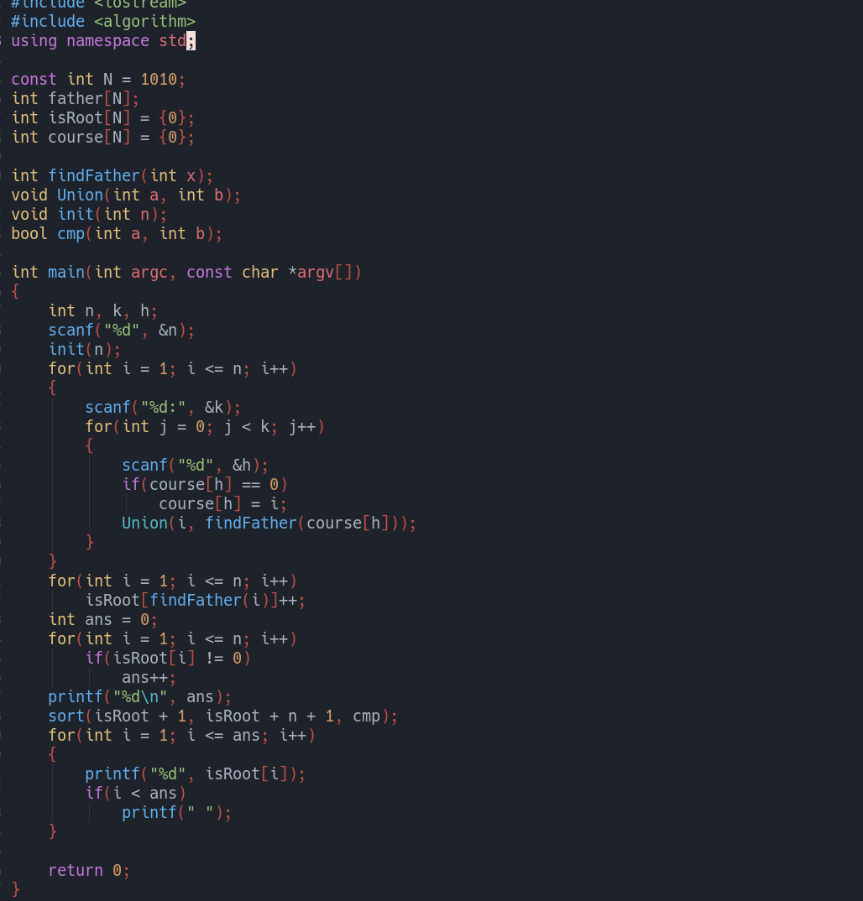

This is a repository of some of my solution codes for *Base Level* and *Advanced Level* problems on [pintia.cn](https://pintia.cn/).

solution topics including:
- Linked List
- Binary Tree
- Search (DFS / BFS);
- Greedy Algorithm
- Graph
- Union & Find Set
- ...

